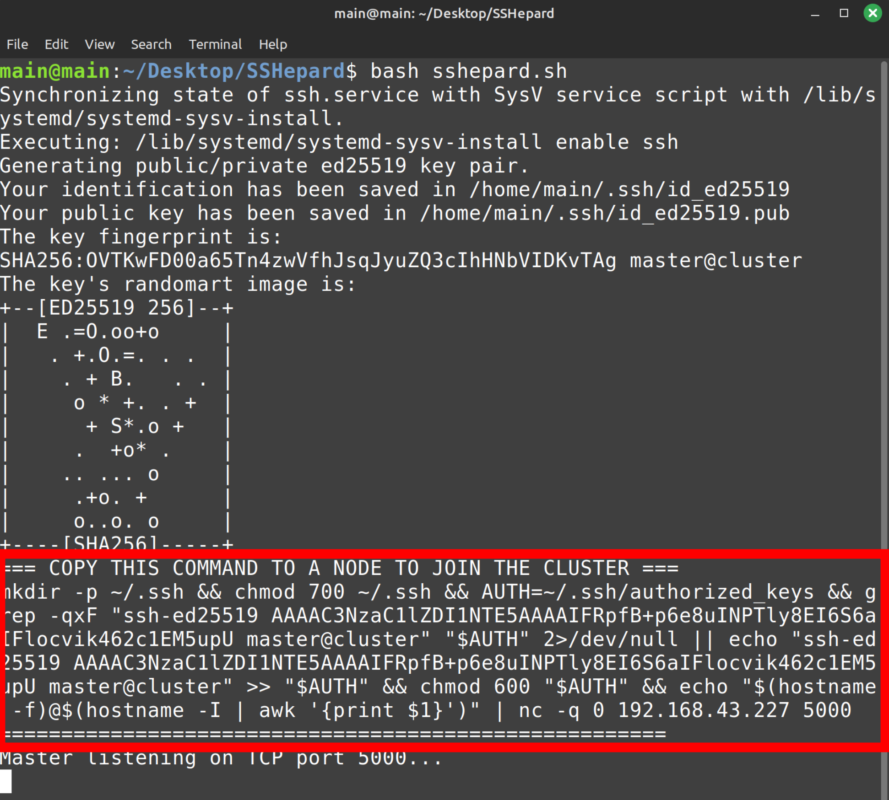

# SSHepard 🐑 Lightweight SSH Cluster Registrar

**SSHepard** is a lightweight master–node cluster registrar using `SSH` and `netcat`.  

- Easily set up a **master node** that listens for new nodes.
- Automatically adds nodes to `authorized_keys` for passwordless SSH.
- Maintains a log of nodes in `cluster_nodes.txt`.
- Adds node ED25519 keys to `known_hosts`.
- Rate-limits repeat joins for security.

## 🔧 How to Use

1. Clone the repo:
   ```bash
   git clone <repo_url>
   cd SSHepard
2. Run the master on your main node:

      ```
      bash sshepard.sh
3. Copy the generated join command and run it on any machine/node you want to add to the cluster.



## ⚡ Features

-   🐺 Minimal dependencies: Bash + OpenSSH + netcat
-   🔑 Passwordless SSH setup automatically
-   📄 Logs all nodes in `cluster_nodes.txt`
-   🛡️ Adds node ED25519 keys to `known_hosts`
-   ⏱️ Duplicate detection & rate-limiting
-   💡 Lightweight, DIY cluster registration

---


<sup>
“Guide your cluster like a shepherd guides their flock.” ✨
</sup>

