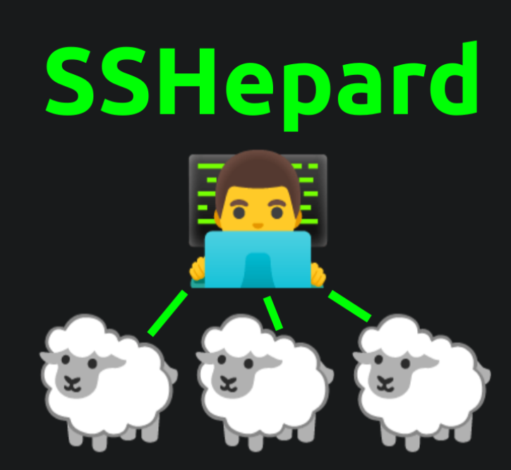

# 🐑 SSHepard - Lightweight SSH Cluster Registrar
<p align="center">



</p>

## ⚡ Features

-   🐺 Minimal dependencies: Bash + OpenSSH + netcat
-   🔑 Passwordless SSH setup automatically
-   📄 Logs all nodes in `cluster_nodes.txt`
-   🛡️ Adds node ED25519 keys to `known_hosts`
-   ⏱️ Duplicate detection & rate-limiting
-   💡 Lightweight, DIY cluster registration

## 🔧 How to Use

1. Clone the repo:
   ```bash
   git clone https://github.com/prim4t/SSHepard.git
   cd SSHepard
2. Run the master on your main node:

      ```
      bash sshepard.sh
3. Copy the generated join command and run it on any machine/node you want to add to the cluster.


## 🖥 Demo

[](https://asciinema.org/a/734071)

---


<sup>
“Guide your cluster like a shepherd guides their flock.” ✨
</sup>
